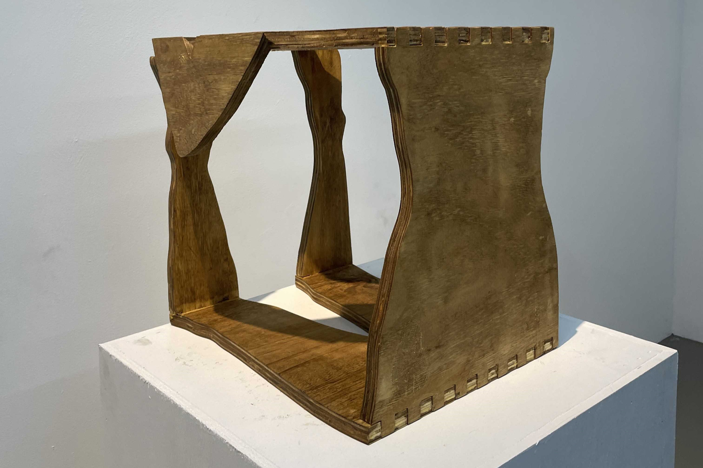
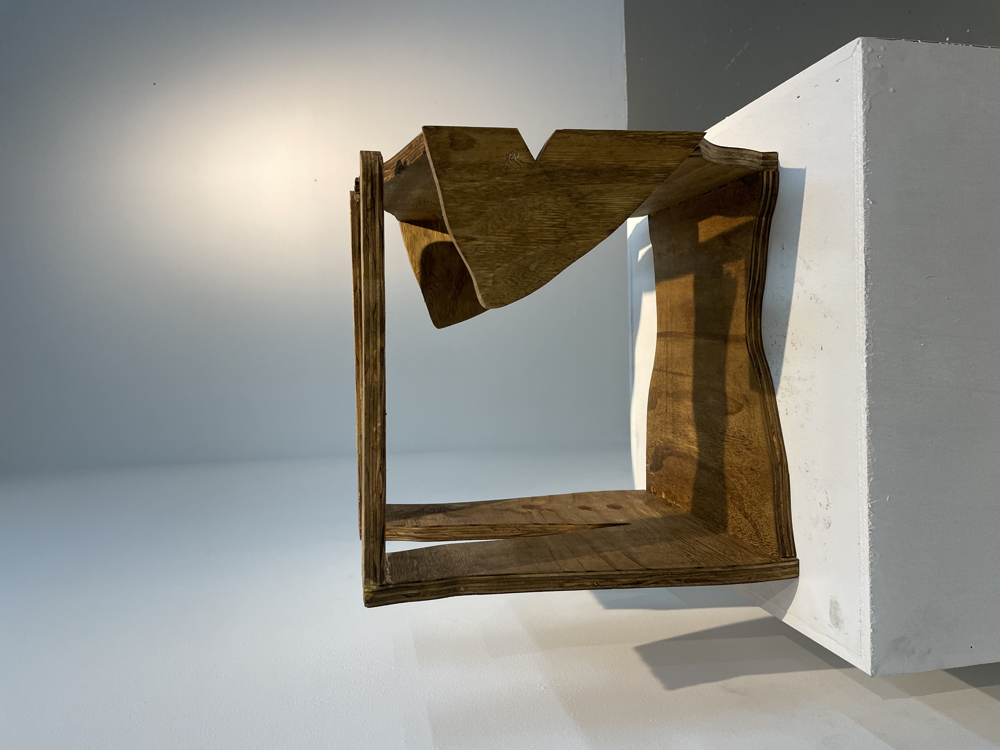

- Plywood
- Wood stain
- Wood glue

I have always been interested in the self-portrait; in finding ways to represent myself, I understand who I am. That is the common desire, right? To know who you are? Here, I also used a digital background to assist in the creation of this piece. I used the CNC to trace my outline from an image I took of myself. I used box joints to join the head, torso, legs of my body, and butt joints for my arms. In this I question a few things:

Do I want to be used as furniture?
Am I constructed from cheaply made material?
Is a body still a body when it is flat?
What makes a body look happy in posture?
