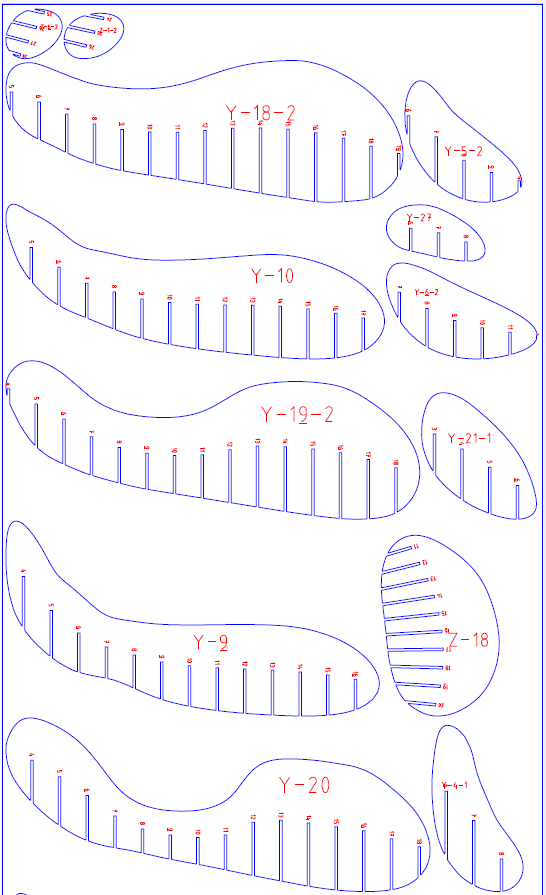

This is a cardboard hand as a practice to push myself in my new sculpture class. The concept was any cardboard structure that can hold your body. This one I modeled in Maya (though I would've preferred other programs) and sliced with Slicer for Fusion 360.

As some of the pieces were larger than what could fit on our Laser Cutters at Tandon's Makerspace, I decided to handcut each one on the bandsaw. This was both faster than using a box cutter, and gave a nice consistent edge on each cut.

I am pretty happy with this project and I can safely sit on it like a comfortable little stool.
