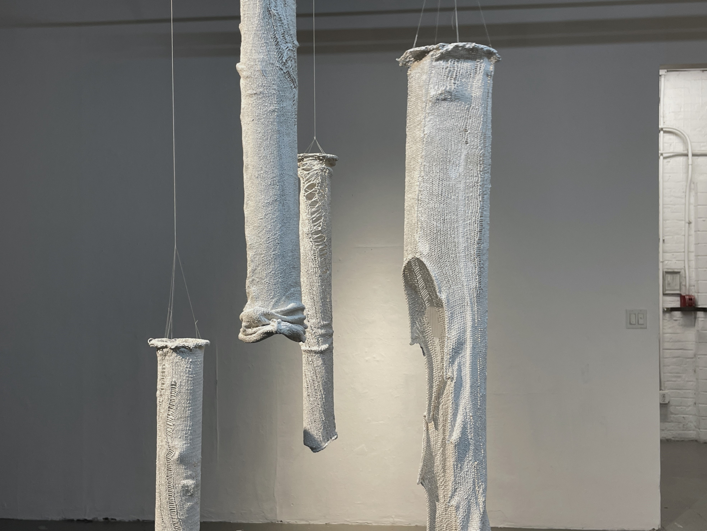
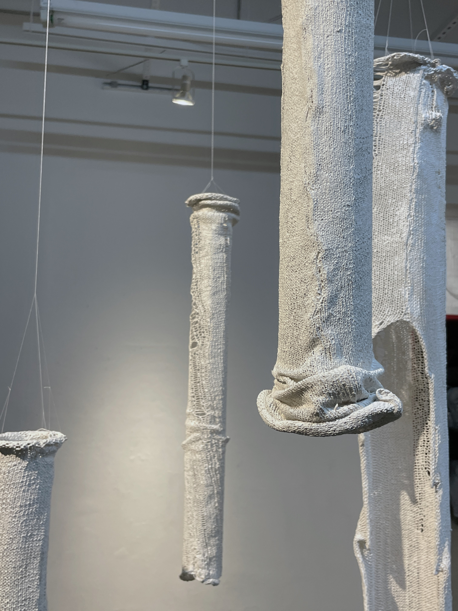

- Plaster
- Wool knit fabric
- Polyester thread

This untitled plaster piece is an experiment in using knit fabric as a material. A knit piece holds live loops with each row. If mistakes are made, stitches drop, creating rows down the fabric. Sometimes, the friction of the fiber holds that drop stitch just enough at an inflection point where if just a little bit of stretch tensions the row, it continues to drop down the line. Plaster is something that saves these little moments in time and makes a once soft material uncomfortably brittle but still strikingly gently draped.

